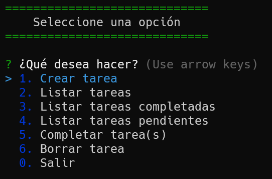

# Tareas por hacer

CRUD de tareas por hacer en consola usando Node.js.

> ### How to clone

`git clone https://github.com/derianrddev/node-tareas-hacer.git`
 

> ### Install dependencies

`npm install`